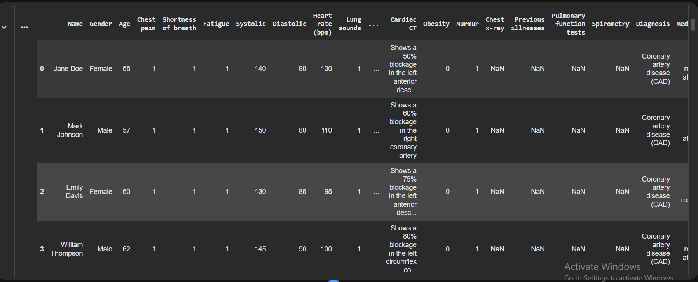
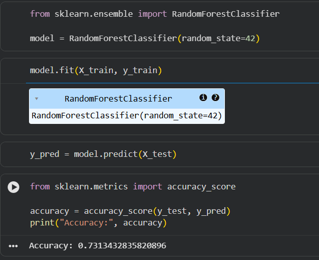
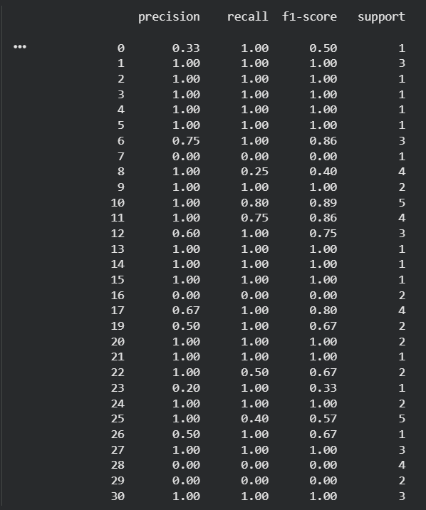
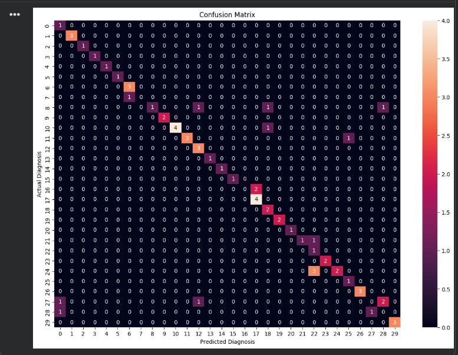
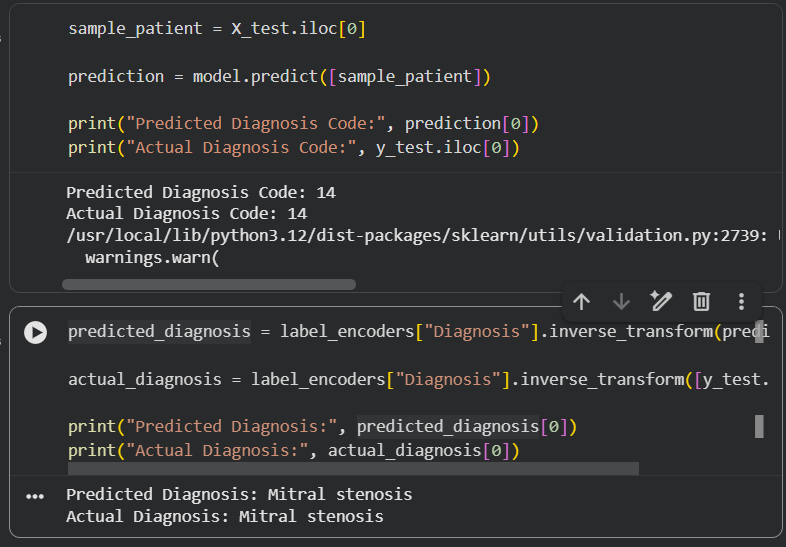

# Heart Disease Diagnosis Prediction using Machine Learning

## Project Description

This project predicts the type of heart disease diagnosis using machine learning techniques.  
The model is trained using patient medical details such as age, gender, chest pain, blood pressure, heart rate, cholesterol level, diabetes, hypertension, smoking, obesity, and other medical conditions.

This is a multi-class classification project because the model predicts different types of heart disease diagnoses.

---

## Dataset

The dataset used in this project is `Heart_disease_details.csv`.

The dataset contains:

- 334 patient records
- 49 columns/features
- Numerical and categorical medical data
- Diagnosis column as the target variable

---

## Objective

The main objective of this project is to build a machine learning model that can predict the diagnosis type of heart disease using patient health-related information.

---

## Technologies Used

- Python
- Google Colab
- Pandas
- NumPy
- Matplotlib
- Seaborn
- Scikit-learn

---

## Machine Learning Type

This project uses:

- Supervised Learning
- Classification
- Multi-class Classification

---

## Model Used

The machine learning model used in this project is:

- Random Forest Classifier

Random Forest Classifier was selected because the dataset contains multiple diagnosis categories, and it works well with both numerical and encoded categorical data.

---

## Project Workflow

1. Import required libraries
2. Load the dataset
3. View the first rows of the dataset
4. Check dataset size
5. Check column names
6. Check missing values
7. Select the target column
8. Remove unnecessary text-heavy columns
9. Handle missing values
10. Convert categorical data into numerical values
11. Split data into training and testing sets
12. Train the machine learning model
13. Make predictions
14. Evaluate the model using accuracy score
15. Display classification report
16. Display confusion matrix
17. Test one patient prediction

---

## Data Preprocessing

During preprocessing, unnecessary text-heavy columns such as patient name, cardiac CT, chest x-ray, medications, and treatment were removed.

Missing values were handled based on the data type:

- Text missing values were filled with `Unknown`
- Numerical missing values were filled with `0`

Categorical data was converted into numerical values using Label Encoding.

---

## Target Variable

The target variable of this project is:

```text
Diagnosis
```
The model predicts the diagnosis type of heart disease based on patient details.

---

## Model Evaluation

The model was evaluated using the following metrics:

- Accuracy Score
- Classification Report
- Precision
- Recall
- F1-score
- Confusion Matrix

---

## Results

The Random Forest Classifier achieved an accuracy of:

```text
73.14%
```
This means the model correctly predicted around 73% of the test data.

---

##Sample Prediction

Example prediction result:

```text
  Predicted Diagnosis: Mitral stenosis
  Actual Diagnosis: Mitral stenosis
```

This shows that the model correctly predicted the diagnosis for one test patient.

---

## Screenshots

### Dataset Overview



### Accuracy Result



### Classification Report



### Confusion Matrix



### One Patient Prediction



---

## Conclusion

This project helped me understand how classification machine learning models work.
I learned how to handle a medical dataset, preprocess categorical and numerical data, train a classification model, and evaluate the model using accuracy score, classification report, and confusion matrix.

This project is part of my machine learning learning journey after completing regression and dashboard-based ML projects.
